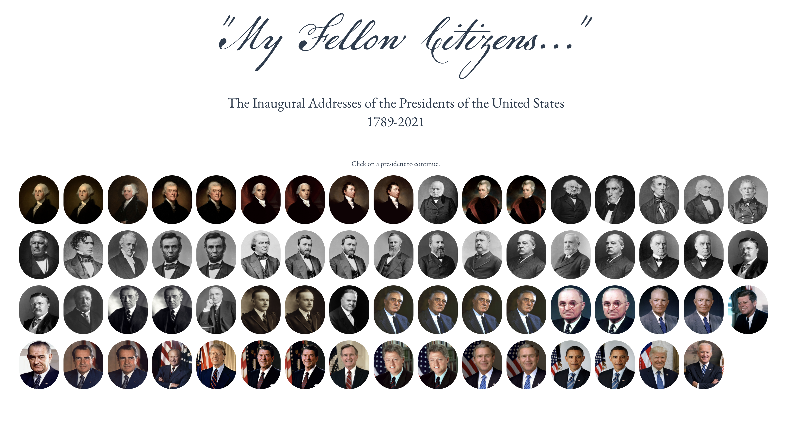
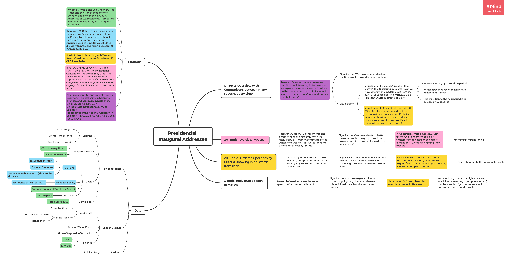

# Title My Fellow Citizens 

# Subtitle  

A Visual Exploration of the United States Presidential Inaugural Addresses (1789-2021)

# Preview

# Abstract

The United States Presidential inaugural speeches serve to form a qualitative and historical basis for applying data visualization techniques.    This data visualization serves to illuminate historical context, further evaluate the texts, and aid in their appreciation.   Visualization techniques employed are designed to aid in topical exploration & allow user agency to enable new discovery of insights.

## 1.  Topic:  Overview with Comparisons between many speeches over time

### Research Question:  where do we see transitions or interesting in-betweens as we explore the various speeches?  Where do the modern presidents similar or not similar to predecessors?  Where do we see the shifts occur?    

- Significance:  We can greater understand the times we live in and how we got here.
- Visualization

	- Visualization 1: Speeech/President LEvel View With a Clustering by Scores (to Show how different the modern era is from the early presidents, and  This might also look like Venn Diagram (Brath page 157)

		- Allow a filtering by major time period
		- Which speeches have similarities are different (distance)
		- The transition to the next period is to select some speeches.

	- Visualization 2: Similar to above, but with Micro Text Line.  X axis would be time.  Y axis would be an index score.  Each line would be showing the increase/decrease of score over time, for example Flesch reading level score.  Brath pg 139

## 2A  Topic:  Words & Phrases  

### Research Question:   Do these words and phrases change significantly when we filter?  Popular Phrases Coordinated by the Dimensions (scores).  This would identify at a more detail level by Preside

- Significance:  Can we understand better the ways people in very high positions power attempt to communicate with us, persuade us?

	- Visualization 3 Word Level View, with filters, X/Y arrangement could be scatterplot type based on selectable dimensions.   Words highlighting shows excerpt.  

		- Incoming filter from Topic 1

## 2B.  Topic:  Ordered Speeches by Criteria, showing initial words from each.   

### Research Question:  I want to show beginnings of speeches, with special ordering (say by Flesch Score, or other dimensions) 

- Significance:  In order to understand the scoring what scored/high/low and encourage user to explore to the lowest level

	- Visualization 4:  Speech Level View show the speeches ranked by criteria (rank n , highest/lowest).  Click down opens Topic 3, individual complete speech

		- Expectation: get to the individual speech

## 3 Topic: Individual Speech, complete

### Research Question:  Show the entire speech.  What was actually said?  

- Significance: How can we get additional context highlighting clues to understand this individual speech and what makes it unique

	- Visualization 5:  Speech level view , extended from topic 2B above. 

		- expectation: go back to a high level view, or click on something to jump to another (similar speech).   (get mouseover / tooltip recommendations mid speech)

## Data

### Text of speeches

- Lengths

	- Word Length
	- Words Per Sentence
	- Avg. Length of Words

- Speech Parts

	- Word Imagery(Nouns)
	- Uncommon words

- Goals

	- Relational

		- occurrence of "your" 
		- Personal Pronouns
		- Sentences with "We" or "I" (Shorten the distance)

	- Modality (Desire)

		- occurrence of "will" or "must"

	- Dictionary of Affect(Emotional Space)
	- Persuasion

		- Positive p269

- Complexity

	- Flesch Score p269

### Speech Settings

- Audiences

	- Other Politicians
	- Mass Media

		- Presence of Radio
		- Presence of TV

- Time of War or Peace
- Time of Depression/Prosperity
- Rankings

	- 10 Best
	- 10 Worst

### President

- Political Party

## Citations

### Whissell, Cynthia, and Lee Sigelman. “The Times and the Man as Predictors of Emotion and Style in the Inaugural Addresses of U.S. Presidents.” Computers and the humanities 35, no. 3 (August 1, 2001): 255–72. 

### Chen, Wen. “A Critical Discourse Analysis of Donald Trump’s Inaugural Speech from the Perspective of Systemic Functional Grammar.” Theory and Practice in Language Studies 8, no. 8 (August 2018): 966–72. https://doi.org/http://dx.doi.org/10.17507/tpls.0808.07. 

### Brath, Richard. Visualizing with Text. AK Peters Visualization Series. Boca Raton, FL: CRC Press, 2020. 

### BOSTOCK, MIKE, SHAN CARTER, and MATTHEW ERICSON. “At the National Conventions, the Words They Used.” The New York Times. The New York Times, September 7, 2012. https://archive.nytimes.com/www.nytimes.com/interactive/2012/09/06/us/politics/convention-word-counts.html. 

### Alix Rule ; Jean-Philippe Cointet ; Peter S. Bearman.      Lexical shifts, substantive changes, and continuity in State of the Union discourse, 1790–2014
United States: National Academy of Sciences
Proceedings of the National Academy of Sciences - PNAS, 2015-09-01, Vol.112 (35), p.10837-10844

